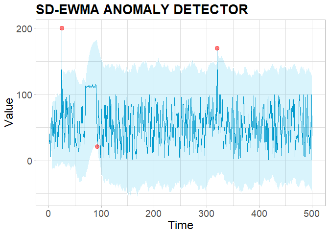

<!-- README.md is generated from README.Rmd. Please edit that file -->
otsad
=====

*Online Time Series Anomaly Detectors*

This package provides anomaly detectors in the context of online time series and their evaluation with the Numenta score.

Installation
------------

### Dependencies

CAD-OSE algorithm is implemented in Python. It uses [bencode](https://pypi.org/project/bencode-python3/) library in the hashing step. This dependency can be installed with the Python package manager *pip*.

``` sh
$ sudo pip install bencode-python3
```

### otsad package

You can install the released version of otsad from [CRAN](https://CRAN.R-project.org) with:

``` r
# Get the released version from CRAN
install.packages("otsad")

# Get the latest development version from GitHub
devtools::install_github("alaineiturria/otsad")
```

Most useful functions
---------------------

### Detectors

-   **PEWMA**
    -   Offline: `CpPewma`
    -   Online: `IpPewma`
-   **SD-EWMA**
    -   Offline: `CpSdEwma`
    -   Online: `IpSdEwma`
-   **TSSD-EWMA**
    -   Offline: `CpTsSdEwma`
    -   Online: `IpTsSdEwma`
-   **KNN-ICAD**
    -   Offline: `CpKnnCad(ncm.type = "ICAD")`
    -   Online: `IpKnnCad(ncm.type = "ICAD")`
-   **KNN-LDCD**
    -   Offline `CpKnnCad(ncm.type = "LDCD")`
    -   Online: `IpKnnCad(ncm.type = "LDCD")`
-   **CAD-OSE**
    -   Offline and Online: `ContextualAnomalyDetector`

### NAB score

-   Get score: GetDetectorScore
-   Normalize score: `NormalizeScore` + `GetNullAndPerfectScores`

### False Positve Reduction

-   Offline and Online: `ReduceAnomalies`

### Static or interactive visualizations

-   Offline: `PlotDetections`

***NOTE:*** *As usual in R, the documentation pages for each function can be loaded from the command line with the commands ? or help:*

``` r
?CpSdEwma
help(CpSdEwma)
```

Example
-------

This is a basic example of the use of otsad package:

``` r
library(otsad)

## basic example code

# Generate data
set.seed(100)
n <- 500
x <- sample(1:100, n, replace = TRUE)
x[70:90] <- sample(110:115, 21, replace = TRUE) # distributional shift
x[25] <- 200 # abrupt transient anomaly
x[320] <- 170 # abrupt transient anomaly
df <- data.frame(timestamp = 1:n, value = x)

# Apply classic processing SD-EWMA detector
result <- CpSdEwma(data = df$value, n.train = 5, threshold = 0.01, l = 3)
```

``` r
res <- cbind(df, result)
PlotDetections(res, title = "SD-EWMA ANOMALY DETECTOR", return.ggplot = TRUE)
```



See plotly [interactive graph](https://alaineiturria.github.io/otsad/)

For more details, see otsad documentation and vignettes.
